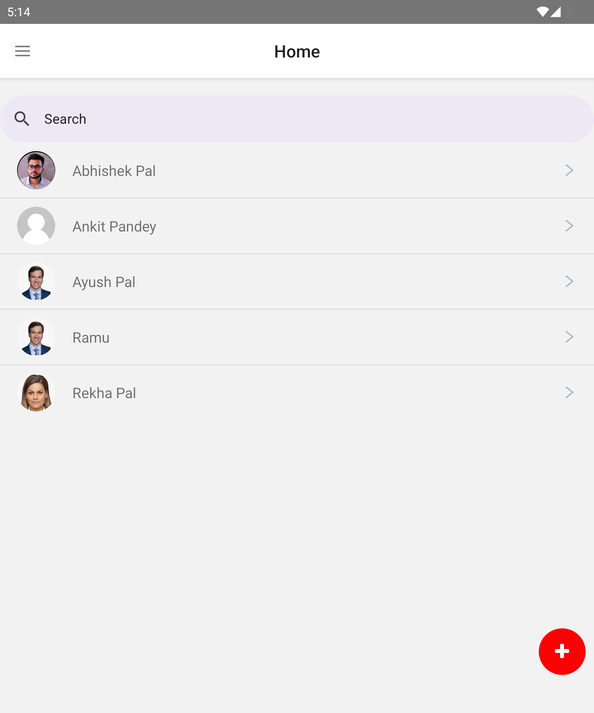
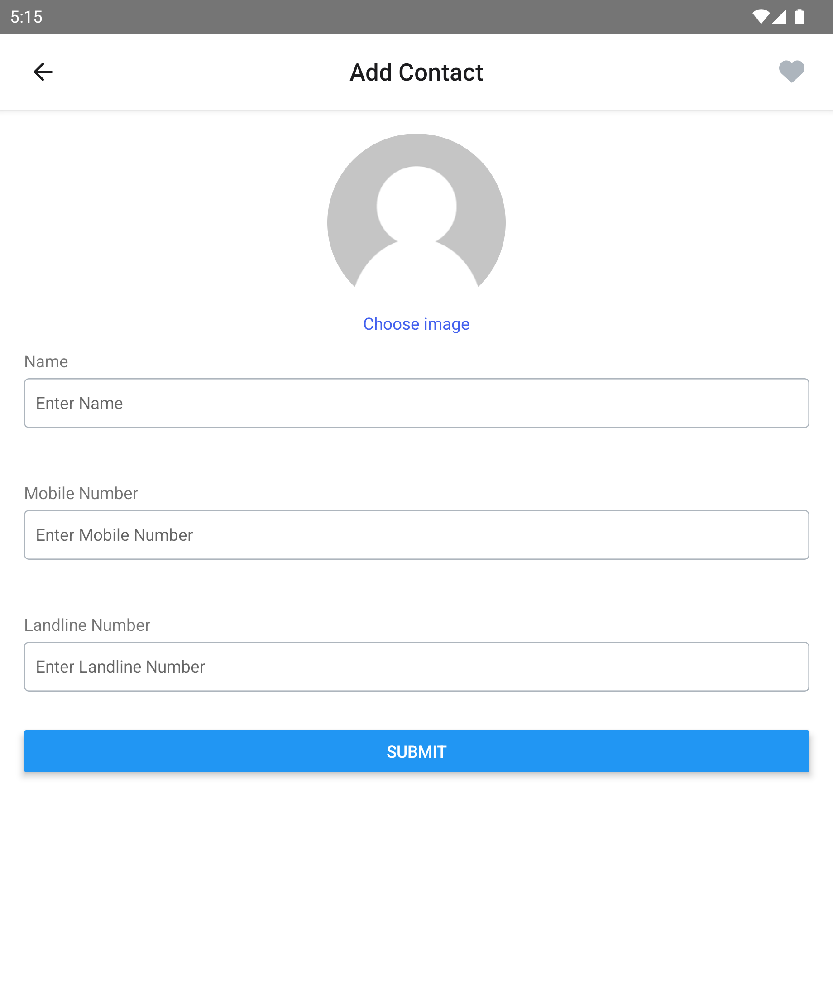
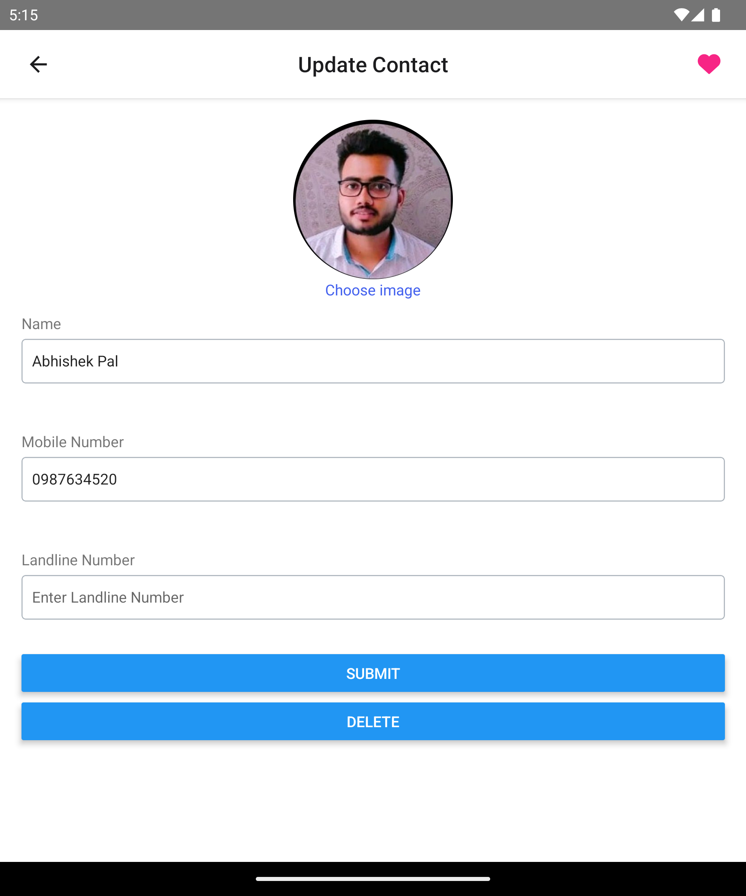
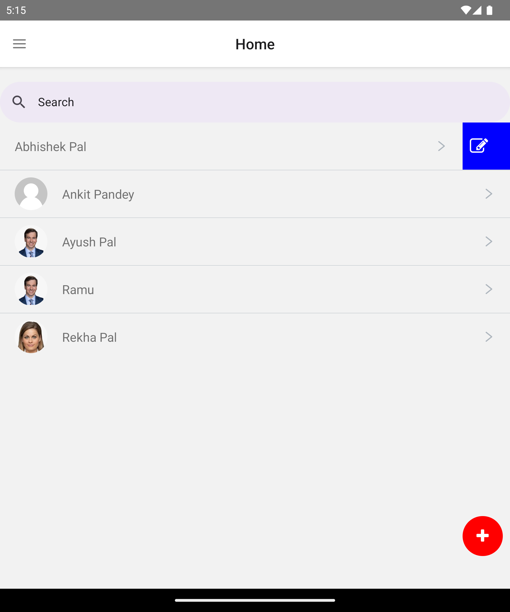
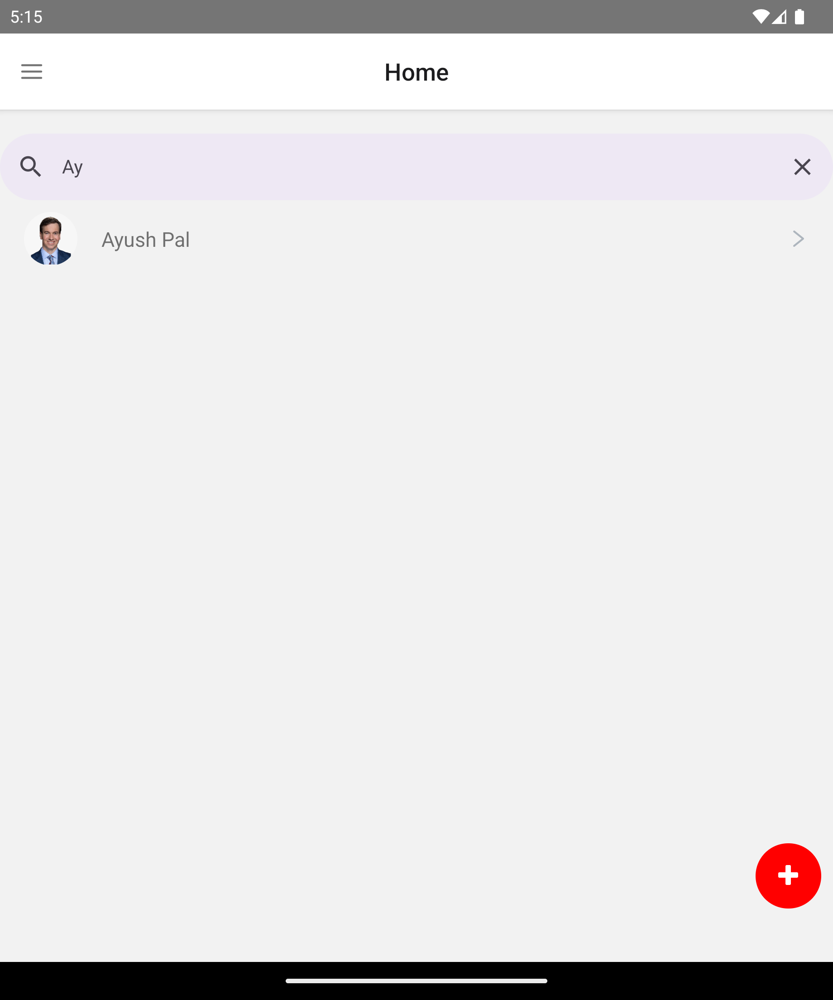
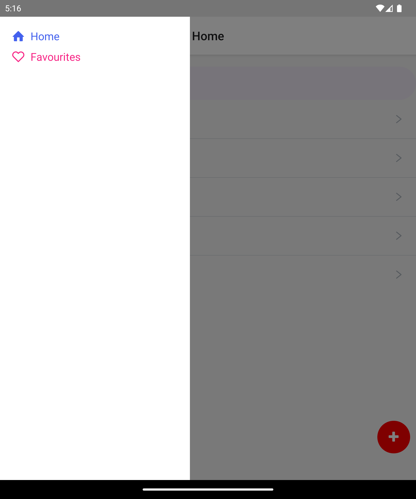
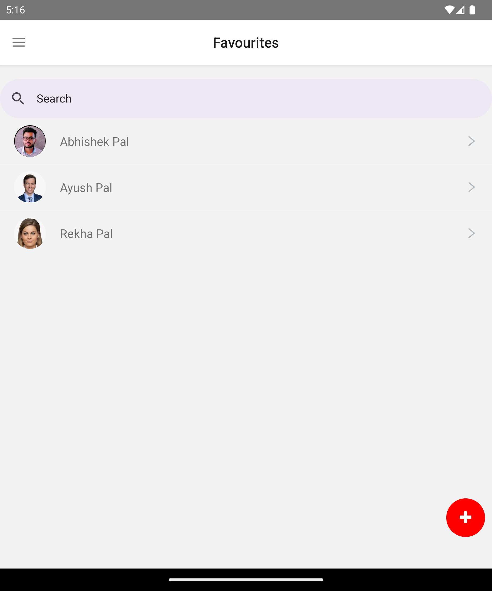

This is a new [**React Native**](https://reactnative.dev) project, bootstrapped using [`@react-native-community/cli`](https://github.com/react-native-community/cli).

# Getting Started

> **Note**: Make sure you have completed the [React Native - Environment Setup](https://reactnative.dev/docs/environment-setup) instructions till "Creating a new application" step, before proceeding.

## Step 1: Start your Application

### For Android

```bash
# using npx

npx react-native run-android


```

### For iOS

```bash
# using npx

npm react-native run-ios
```

If everything is set up _correctly_, you should see your new app running in your _Android Emulator_ or _iOS Simulator_ shortly provided you have set up your emulator/simulator correctly.

This is one way to run your app — you can also run it directly from within Android Studio and Xcode respectively.

### ScreenShots

Home:-



Add Contact and favourite Icon:-



Update contact:



Right Swipe edit Icon:-



Search bar:-



Drawer Navigation List:-



Favourites:-


